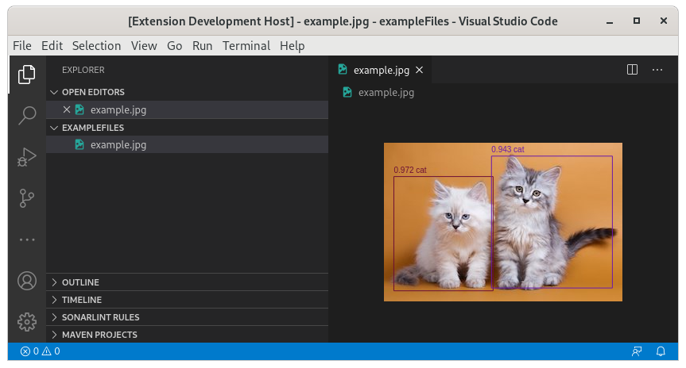

# Object detection on VS Code

  

Putting together VS Code extension, tensorflow.js, and object detection (coco-ssd) into a simple project.

Just for fun. :P

## Running the example

- Open this example in VS Code 1.46+
- `npm install`
- `npm run watch` or `npm run compile`
- `F5` to start debugging

Open any png or jpg file.

VS Code will render the image with all detected bounding boxes.
